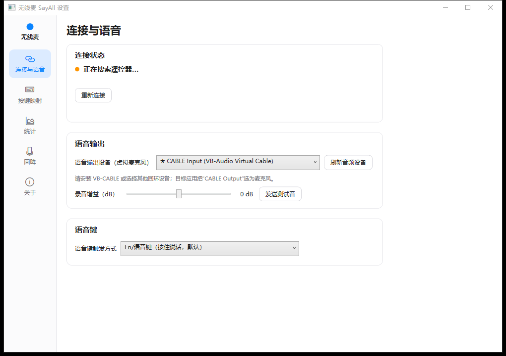
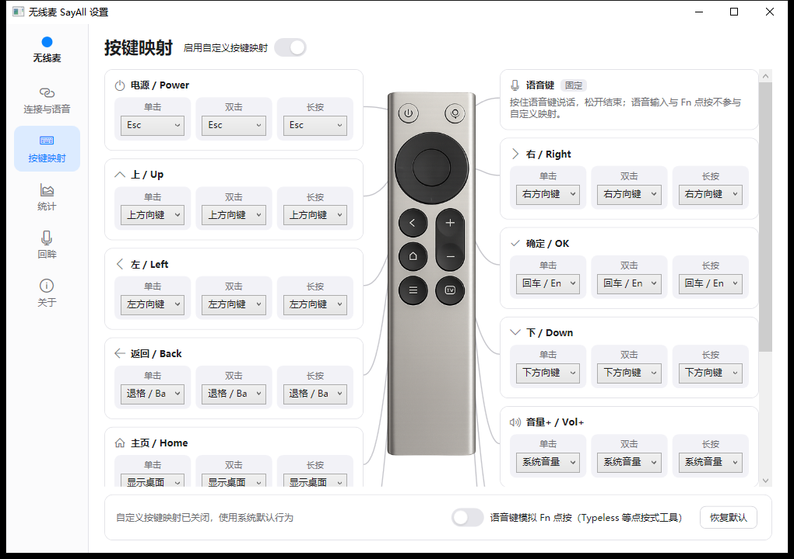
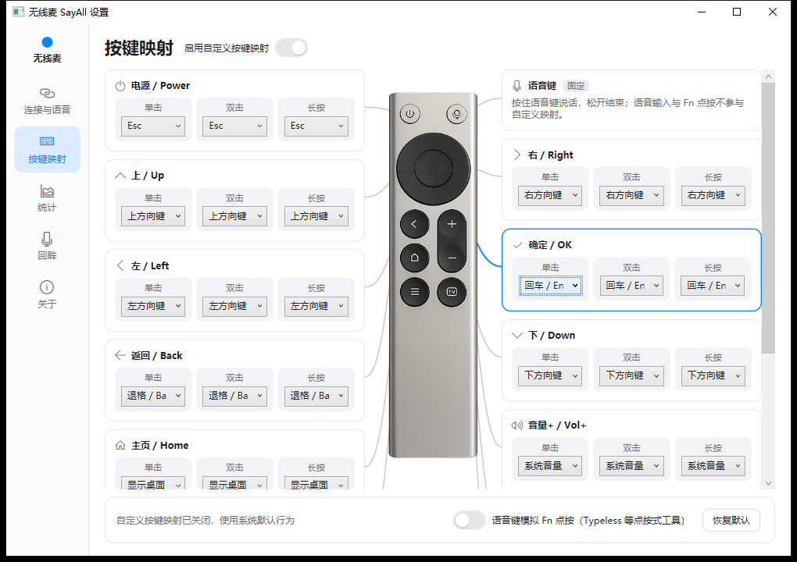
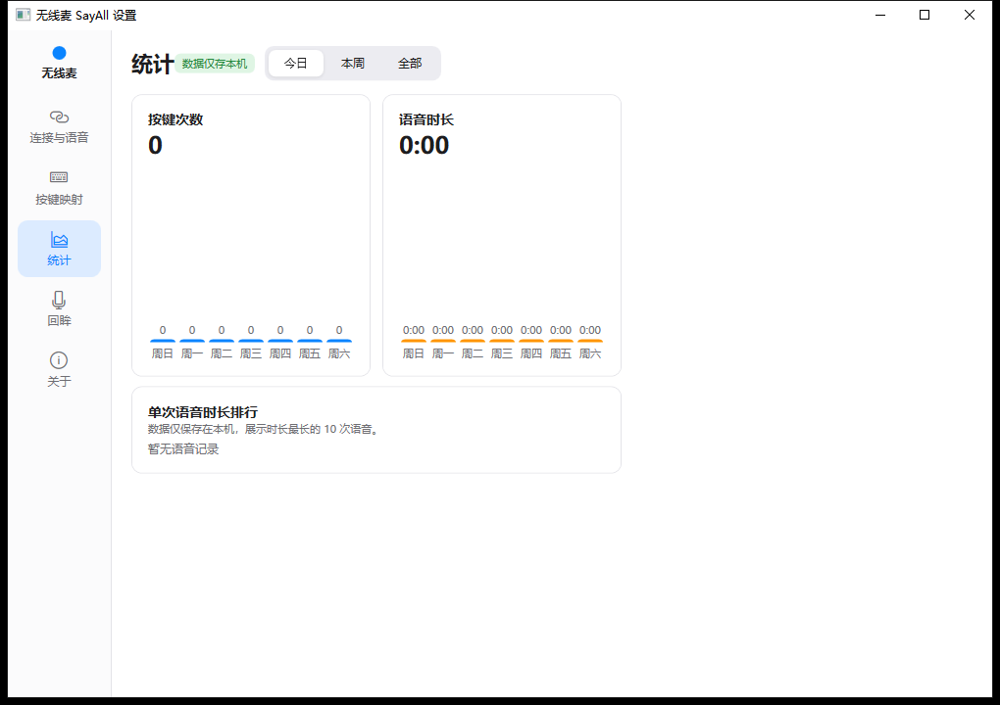
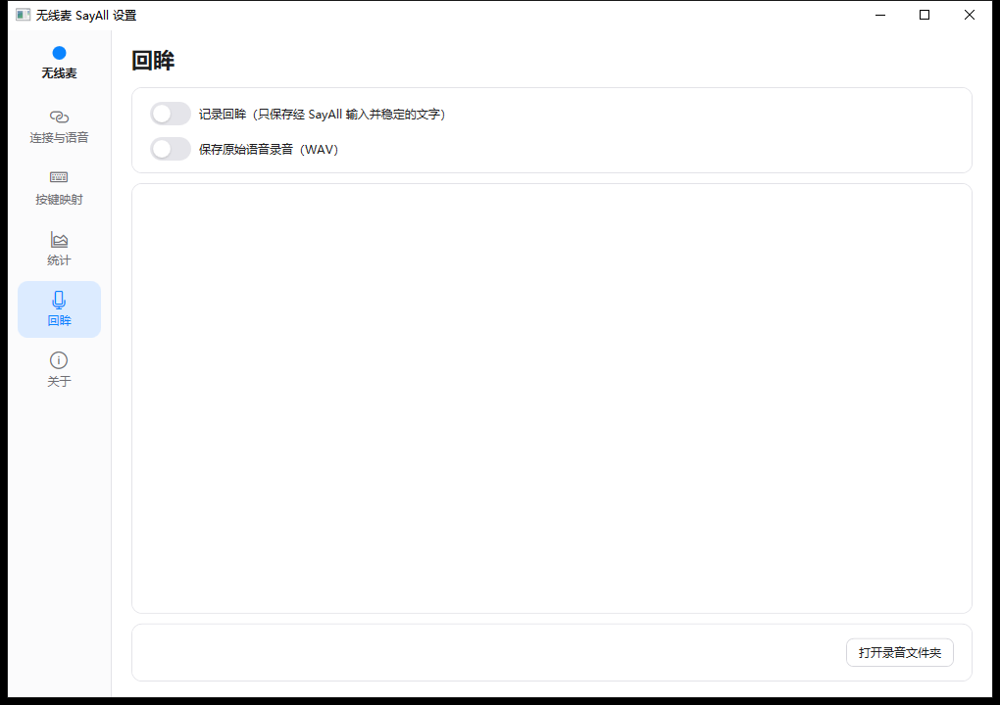
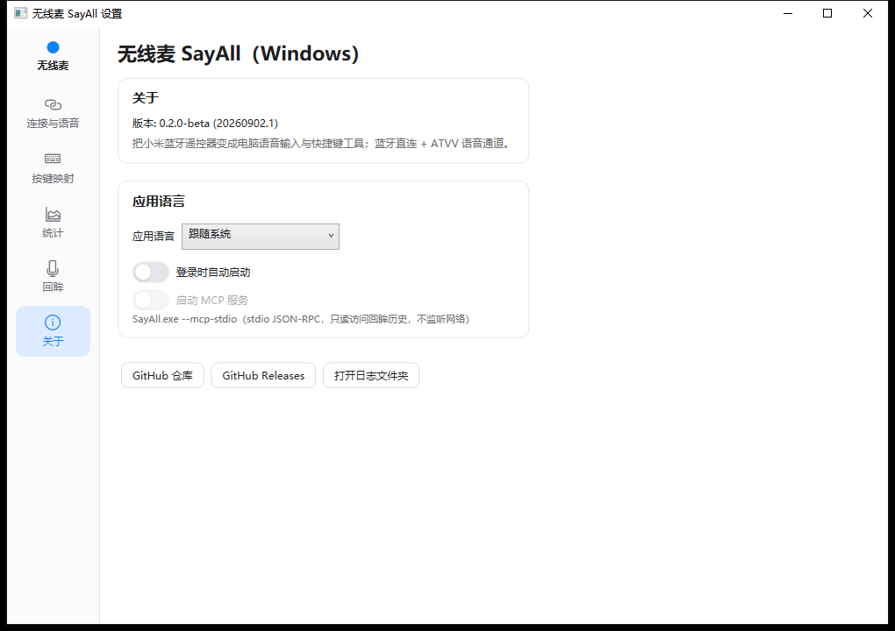

# 无线麦 SayAll — Windows 适配版（SayAllWin）

把小米蓝牙遥控器 2 Pro（RC003）变成 Windows 的无线麦克风与语音快捷键：按住遥控器语音键说话、松开停止，语音经蓝牙进入电脑；遥控器其余按键成为可自定义的快捷键。

> **项目来源**：本项目是 [HD838A/remote-mic-app](https://github.com/HD838A/remote-mic-app)（macOS 版，SwiftUI）的 **Windows 适配**。`SayAllWin/` 下的全部 C#/XAML 代码是针对 Windows 平台的同源移植实现：所有 ATVV 协议字节、IMA-ADPCM 语音解码、重连时序常量与 macOS 版保持一致，界面与交互对齐 macOS 版布局。
>
> **开源协议**：本项目遵循 **GPL-3.0** 许可证，完整协议文本见 [LICENSE.md](LICENSE.md)。

## 功能概览

| 能力 | Windows 实现 |
| --- | --- |
| 蓝牙 / ATVV 语音 | WinRT `BluetoothLEDevice`（GATT Notify），MIC_OPEN / 租期延长 / 电量与充电状态 |
| 音频输出（虚拟麦克风） | WASAPI 共享模式渲染到所选播放设备（虚拟声卡由使用者自行准备，本程序不捆绑、不安装任何驱动） |
| 遥控器按键 | SetupAPI 枚举 + `ReadFile` 原始报告（1.5 秒轮询热插拔） |
| 物理事件抑制 | `WH_KEYBOARD_LL` 低级钩子在原始报告边缘 180ms 窗口内吞掉对应事件（尽力而为） |
| 按键注入 | `SendInput` |
| 语音键 | 遥控器语音键 = HID 用法 0x3E；Windows 无 Fn 概念，注入 F13（按住 / 点按两种语义；F13 在浏览器等场景无副作用） |
| 系统唤醒重连 | `SystemEvents.PowerModeChanged(Resume)` |
| 开机自启 | HKCU `Run` 注册表键 |
| 本地 Agent 访问 | `SayAll.exe --mcp-stdio`（stdio JSON-RPC，只读回眸检索，不监听网络） |
| 应用切换器 | Alt+Tab 会话（15 秒超时语义与 macOS 版一致） |

设置窗口包含五个页面：**连接与语音 / 按键映射 / 统计 / 回眸 / 关于**（中文界面，附英文）。

## 使用要求

| 项目 | 要求 |
| --- | --- |
| 操作系统 | Windows 10 19041（2004）或更高，64 位；兼容 Windows 11 |
| 蓝牙 | 支持 BLE 的蓝牙适配器（台式机建议 4.2 以上 USB 蓝牙模块） |
| 遥控器 | 小米蓝牙遥控器 2 Pro（RC003） |
| 虚拟声卡 | 需自备一款虚拟声卡/回环驱动（开源或免费方案均可），作为遥控器语音的"虚拟麦克风"落点；本程序不捆绑、不安装任何驱动 |
| 构建环境 | 仅从源码构建时需要：支持 `net10.0-windows10.0.19041.0` 目标的 .NET SDK |

## 下载与安装

本仓库只提供源码，请自行构建：

```powershell
git clone https://github.com/mayprogress/remote-mic-app-win.git
cd remote-mic-app-win

# 构建
dotnet build SayAllWin\SayAllWin.csproj -c Release

# 或生成自包含产物
dotnet publish SayAllWin\SayAllWin.csproj -c Release -r win-x64 --self-contained true
```

- 构建产物在 `SayAllWin\bin\Release\net10.0-windows10.0.19041.0\`（发布在 `win-x64\publish\`）。
- 双击 `SayAll.exe` 启动；若系统对未签名程序弹出 SmartScreen 提示，点「更多信息 → 仍要运行」。
- 启动后主窗口打开，同时进入系统托盘。**关闭设置窗口不会退出程序**，要完全退出请用托盘右键菜单。
- 启动方式：`SayAll.exe` = 设置窗口 + 托盘；`SayAll.exe --tray` = 只进托盘；`SayAll.exe --mcp-stdio` = 本地 Agent 访问模式。

## 首次使用（三步）

**第 1 步 · 连接遥控器**：长按遥控器「主页 + 菜单」键约 3 秒进入配对模式，在 Windows「设置 → 蓝牙和其他设备」完成配对；打开遥控器电源后，程序会自动搜索并连接，状态圆点变绿并显示电量。

**第 2 步 · 选择语音输出设备**：在「语音输出」卡的下拉中选择虚拟声卡的播放端，点「发送测试音」验证链路；「录音增益」滑杆可微调音量。

**第 3 步 · 让应用使用语音**：把接收端应用的麦克风输入设备设为虚拟声卡的录音端（或设为系统默认输入设备）。语音转文字由接收端应用完成，本程序不负责识别，也不限定具体工具。

<p align="center">
  
  <br><i>「连接与语音」页：上=连接状态（变绿即已连接，显示电量）；中=语音输出（选择设备 + 发送测试音 + 录音增益）；下=语音键触发方式。</i>
</p>

## 使用方法

### 语音

按住语音键（遥控器顶部带麦克风图标的键）→ 开始说话 → 松开结束。语音键只支持"按下-松开"会话，没有双击/长按手势（与 macOS 版一致，保证语音响应最快）。

### 语音键触发方式

| 模式 | 行为 | 适用 |
| --- | --- | --- |
| **Fn/语音键（按住说话，默认）** | 按住说话期间保持 F13 键按下，松开释放 | 听写/输入工具把触发键设为 F13 |
| **左 Command 长按**（Windows = 左 Ctrl） | 按住语音键 = 按住左 Ctrl | 目标应用以按住 Ctrl 触发录音 |
| **右 Command 长按**（Windows = 右 Ctrl） | 同上，右 Ctrl | 同上 |
| **Fn 点按** | 开始/结束各点按一次 F13；语音开头最多缓存 0.5 秒补写 | 配合使用方的点按式语音工具（需把触发键设为 F13） |
| **微信输入法按住说话** | 按住期间保持 Ctrl+Win 组合键按下，松开释放 | 配合微信输入法"按住说话"快捷键（Ctrl+Win） |

### 按键映射

方向环、确定、返回、主页、菜单、音量、TV、电源各键默认已有一组合理动作（方向移动、回车、退格、系统音量等）。打开页头「启用自定义按键映射」开关后，可为每个按键分别设置**单击 / 双击 / 长按**三个动作；「恢复默认」一键还原，设置自动保存。

<p align="center">
  
  <br><i>「按键映射」页：左右两列卡片对齐遥控器实物排布（左列 电源/上/左/返回/主页/菜单，右列 语音键说明/右/确定/下/音量+/音量−/TV），灰色细引线从卡片连到照片上对应按键。</i>
</p>

<p align="center">
  
  <br><i>选中高亮：点击任一下拉设置框后，该卡片边框与对应引线变为蓝色加粗，焦点离开自动恢复灰色。</i>
</p>

### 统计

按键次数、语音时长（今日/本周/全部）、最近 7 天柱状图、单次语音时长排行。所有统计仅保存在本机，不上传任何数据。

<p align="center">
  
  <br><i>「统计」页：按今日/本周/全部切换，含 7 天柱状图与单次时长排行。</i>
</p>

### 回眸

- 「记录回眸」：语音会话结束时自动读取当前焦点输入框中的文字快照保存到本地历史（通过 UI 自动化读取，不是语音识别转写；上限 500 条）。
- 「保存原始语音录音」：把每次语音会话的原始音频存为 WAV（16 kHz 单声道），保存在 `文档\SayAll Recordings\`。

<p align="center">
  
  <br><i>「回眸」页：两个独立开关（记录回眸 / 保存原始录音）+ 会话历史列表 + 打开录音文件夹按钮。</i>
</p>

### 语言与自启

「关于」页支持应用语言切换（跟随系统/中文/English，即时生效）、「登录时自动启动」开关，以及 GitHub / Releases / 日志文件夹快捷入口。

<p align="center">
  
  <br><i>「关于」页：应用语言、登录时自动启动、MCP 说明与快捷入口。</i>
</p>

### 托盘

托盘图标左键/双击 = 打开设置；右键菜单：状态、打开设置、重新连接、GitHub、打开日志文件夹、退出。

## 注意事项

- **数据隐私**：设置、统计、回眸记录全部保存在本机（`%APPDATA%\SayAll\`），不上传任何数据；日志（`%LOCALAPPDATA%\SayAll\logs\runtime.log`，10 MiB × 3 滚动）已脱敏，不含语音内容、蓝牙地址、文件路径。
- **后台驻留**：关闭设置窗口不会退出程序（继续维持蓝牙连接与语音会话）；完全退出请用托盘右键「退出」。
- **按键双重触发**：Windows 无法像 macOS 那样「独占/seize」HID 设备——遥控器按键的原生系统事件靠低级键盘钩子在时间窗口内尽力吞掉，个别前台程序（管理员权限运行的游戏/工具）可能仍收到原生事件，属平台限制；必要时用管理员身份运行本程序。
- **注入键为 F13**：遥控器语音键注入 F13（不是物理 Fn 键）；需在使用方的语音工具中把触发键设为 F13。遥控器物理语音键产生的原生 F5 事件由低级键盘钩子在遥控器活跃期（最近 30 秒内有遥控器操作）持续拦截，不会触发任何软件的 F5 快捷键；同一期间物理键盘 F5 也被拦截（浏览器刷新请用 Ctrl+R），遥控器闲置 30 秒后自动恢复。
- **睡眠唤醒**：系统从睡眠恢复后程序会自动重连遥控器；若长时间未连接，可用「重新连接」按钮或托盘菜单手动重试。
- **升级与卸载**：覆盖源码重新构建即可升级；设置/统计/回眸数据在 `%APPDATA%\SayAll\` 不受影响。卸载时退出程序、删除构建目录，并清除 `%APPDATA%\SayAll\`、`%LOCALAPPDATA%\SayAll\` 与 `文档\SayAll Recordings\`（如有）。

## 仓库范围声明

**本仓库只包含纯净源码**：不分发安装包、可执行程序或运行时环境，不捆绑任何第三方驱动、虚拟声卡或输入法应用。构建产物请自行从源码生成，使用中涉及的第三方组件由使用者自行准备并遵守其自身许可。

## 目录结构

```text
SayAllWin/
├── App.xaml / App.xaml.cs       # 入口：托盘、单实例、--mcp-stdio CLI 模式
├── MainWindow.xaml(.cs)         # 设置窗口：连接与语音/按键映射/统计/回眸/关于
├── UI/  L10n.cs                 # 中英文案（System/zh-Hans/en）
├── UI/  TrayIcon.cs             # 托盘图标与菜单
├── Core/ ATVVProtocol.cs        # ATVV 命令、IMA-ADPCM、后处理、重连策略（同 macOS 常量）
├── Core/ XiaomiBluetoothBridge.cs  # WinRT BLE：发现/连接/订阅/MIC_OPEN/租期延长
├── Core/ HidRemoteMonitor.cs    # 原始 HID 报告 → 手势识别 → 动作执行 + 语音键
├── Core/ HidNative.cs           # SetupAPI 枚举、ReadFile、LL 键盘钩子抑制器
├── Core/ AudioCore.cs           # WASAPI 渲染设备枚举与写入线程、测试音
├── Core/ KeyboardInjector.cs    # SendInput 注入、Alt+Tab 会话、应用启动器
├── Core/ RemoteButtons.cs       # 按键枚举/用法解析/手势状态机（时序同 macOS）
├── Core/ Stores.cs              # 设置/统计/回眸/录音 WAV 会话
├── Core/ AppState.cs            # 编排：会话生命周期、FnTap pre-roll、UIA 回眸捕获
└── Core/ McpServer.cs           # stdio JSON-RPC 只读回眸检索
```

## 键位适配（技术细节）

- 命令键 → Ctrl（复制/粘贴/撤销等全部 Cmd 快捷键转为 Ctrl）
- 显示桌面 → Win+D；重做 → Ctrl+Y；contextMenu → VK_APPS
- fn（语音键）→ 注入 F13：普通模式按住说话期间保持 F13 按下；「Fn 点按」模式改为开始/结束各一次点按，点按模式下语音开头 pre-roll 最多缓存 0.5 秒，点按完成后写入（遥控器物理键的原生 F5 由低级钩子抑制）
- 语音键只支持按下/释放会话生命周期，没有双击/长按触发器（与 macOS 版边界一致）

## 许可证与致谢

- 本项目以 **GPL-3.0** 发布（见 [LICENSE.md](LICENSE.md)），协议与功能设计继承自上游项目。
- 感谢上游 [HD838A/remote-mic-app](https://github.com/HD838A/remote-mic-app) 完成的协议逆向与 macOS 实现——本项目的小米遥控器 ATVV 语音通道、按键手势识别等核心成果均基于上游工作。
